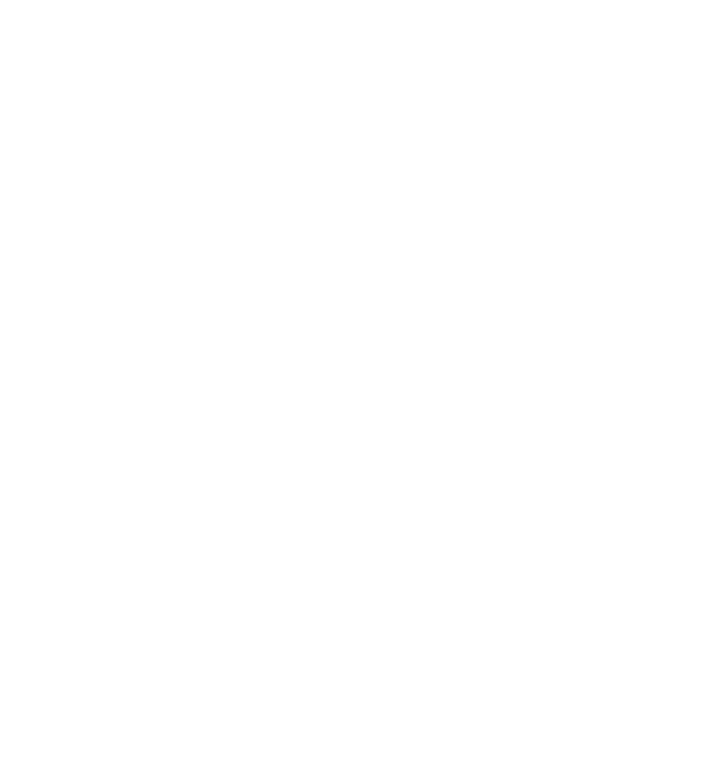

# Orchestration and Workload Best Practices for Cisco AI Pods

To optimize OpenShift deployments and ensure seamless integration with Cisco AI Pods infrastructure, it is essential to focus on cluster architecture, operator management, GPU resource scheduling, and workload optimization.

## Platform Technologies

<p align="center">
	<a href="https://www.openshift.com/"></a>
</p>

This guide outlines the implementation of Phase 6: Orchestration and Workload for Cisco AI Pods. This phase focuses on deploying a production-ready Red Hat OpenShift environment on Cisco UCS bare-metal infrastructure, optimized for high-performance AI training and fine-tuning.

## 1. OpenShift Installation: IPI vs. UPI on Bare Metal

Choosing the right installation method is critical for balancing automation with the granular control required for AI workloads.


Installer-Provisioned Infrastructure (IPI):
Best For: Rapid, standardized deployments where the installer manages the entire lifecycle (including networking and storage provisioning).
Cisco Integration: Leverages Cisco Intersight to automate the Red Hat Enterprise Linux CoreOS (RHCOS) deployment via the Baseboard Management Controller (BMC).
Considerations: Requires a dedicated provisioning network and specific IPAM/DNS configurations. It is less flexible for complex, pre-existing network topologies.
User-Provisioned Infrastructure (UPI):
Best For: Environments requiring maximum customizability, such as specific VLAN tagging, custom disk partitioning, or integration into complex backend fabrics.
Cisco Integration: Requires manual or scripted (Ansible) configuration of UCS Service Profiles and network fabrics before running the OpenShift installer.
Considerations: Provides the control needed to ensure that the high-speed backend fabric (RDMA/RoCE) is correctly mapped to the worker nodes.

## 2. Operator Deployments and Validation

AI workloads require a specialized software stack managed via Kubernetes Operators.


Node Feature Discovery (NFD) Operator:
Role: Detects hardware capabilities (e.g., specific GPU models, RDMA support) and labels nodes accordingly.
Requirement: Must be installed before the GPU Operator so that the GPU Operator knows which nodes require drivers.
NVIDIA GPU Operator:
Role: Automates the deployment of NVIDIA drivers, the CUDA runtime, and the Kubernetes device plugin.
Validation: Use oc describe node <node-name> to verify that nvidia.com/gpu is listed under allocatable resources.
NVIDIA Network Operator:
Role: Configures the networking stack for GPUDirect RDMA. It manages the installation of the MOFED (Mellanox OpenFabrics Enterprise Distribution) drivers and the configuration of the secondary network interfaces used for the backend fabric.
NMState Operator: Used in conjunction to manage the state of network interfaces across the cluster.

## 3. Resource Quotas and LimitRanges for GPU

To ensure fair sharing of expensive GPU resources in a multi-tenant environment:


ResourceQuotas: Define hard limits at the namespace level (e.g., requests.nvidia.com/gpu: 8). This prevents a single team from consuming the entire cluster's capacity.
LimitRanges: Set default and maximum GPU requests per Pod. This ensures that users explicitly define their GPU needs, preventing "greedy" pods from scheduling without limits.
GPU Slicing (MIG): For inferencing workloads, use Multi-Instance GPU (MIG) to partition a single H200/H100 into smaller instances, managed via the same quota system.

## 4. Pod Affinity and GPU Rail Topology

For distributed training, communication latency between GPUs is the primary bottleneck. Cisco AI Pods utilize a rail-optimized topology.


Rail Topology: GPUs of the same "rank" (e.g., GPU #1 in every server) are connected to the same leaf switch in the backend fabric.
Pod Affinity Rules:
Node Affinity: Ensures that distributed training jobs are scheduled on nodes with identical hardware (e.g., UCS C885A M8).
Pod Anti-Affinity: Prevents multiple heavy training jobs from competing for the same PCIe bus or NIC on a single node.
Topology Manager: Configure the OpenShift Topology Manager with a single-numa-node policy to ensure that the GPU, NIC, and CPU are all on the same NUMA domain for the lowest possible latency.

## 5. Validation: NCCL All-Reduce Benchmark

Before moving to production, the backend fabric must be validated using the NVIDIA Collective Communications Library (NCCL) tests.


Objective: Measure the effective bandwidth and latency of the "All-Reduce" operation, which is the most common communication pattern in distributed AI training.

### Execution: Detailed Steps

**Step 1: Prepare the Environment**

Prerequisites and validation before running NCCL tests:

```bash
# Create a dedicated namespace for testing
oc create namespace nccl-tests

# Verify GPU availability on all worker nodes
oc get nodes -L nvidia.com/gpu-product
oc describe nodes | grep -A 10 "nvidia.com/gpu"

# Confirm all GPUs are allocatable (not reserved)
oc describe nodes | grep -E "nvidia.com/gpu:|nvidia.com/gpu "

# Check GPU Operator is running and healthy
oc -n nvidia-gpu-operator get pods -o wide
oc -n nvidia-gpu-operator logs -l app=nvidia-driver-daemonset --tail=50

# Verify Network Operator for RDMA/RoCE is deployed
oc -n nvidia-network-operator get pods -o wide

# Check node feature detection (GPU models should be labeled)
oc get nodes --show-labels | grep nvidia
```

**Recommendations:**
- Ensure all worker nodes have identical GPU models and counts for fair benchmarking
- Verify RDMA/RoCE is enabled on all worker nodes with `ibv_devices` or `rdma link show`
- Disable CPU frequency scaling for consistent benchmarks: `cpupower frequency-set -g performance`
- Pre-pull the NCCL test container image to avoid timing overhead: `oc image pull <image-url>`
- Ensure sufficient memory allocation (recommend 80GB minimum per GPU for large message tests)
- Check network MTU is set to 9000 (jumbo frames) for optimal throughput: `ip link show | grep mtu`

---

**Step 2: Create NCCL Test Pod Manifest**

Deploy a multi-pod setup where each pod runs on a different node. Recommendations for a 4-node setup:

```yaml
apiVersion: v1
kind: Namespace
metadata:
  name: nccl-tests
---
apiVersion: v1
kind: ConfigMap
metadata:
  name: nccl-hostfile
  namespace: nccl-tests
data:
  hostfile: |
    # Format: hostname slots=<num_gpus>
    # Update hostnames to match your environment
    worker-node-1 slots=8
    worker-node-2 slots=8
    worker-node-3 slots=8
    worker-node-4 slots=8
---
apiVersion: batch/v1
kind: Job
metadata:
  name: nccl-allreduce-test
  namespace: nccl-tests
  labels:
    app: nccl-test
spec:
  parallelism: 4                    # Number of pods to run in parallel (one per node)
  completions: 4                    # Total number of pods that must complete
  backoffLimit: 1                   # Fail job after 1 failed pod attempt
  template:
    metadata:
      labels:
        app: nccl-test
    spec:
      nodeSelector:
        node-role.kubernetes.io/worker: ""  # Run only on worker nodes
      affinity:
        # Ensure each pod runs on a different node for multi-node testing
        podAntiAffinity:
          requiredDuringSchedulingIgnoredDuringExecution:
          - labelSelector:
              matchExpressions:
              - key: app
                operator: In
                values:
                - nccl-test
            topologyKey: kubernetes.io/hostname  # Force pod spread across hostnames
      # Recommend strict pod disruption budget during testing
      tolerations:
      - key: "nvidia.com/gpu"
        operator: "Exists"
        effect: "NoSchedule"
      containers:
      - name: nccl-test
        image: nvcr.io/nvidia/pytorch:24.03-py3  # Contains nccl-tests, CUDA, and OpenMPI
        imagePullPolicy: IfNotPresent
        securityContext:
          privileged: true              # Required for RDMA and GPU access
          capabilities:
            add:
            - SYS_ADMIN
            - SYS_PTRACE
        command:
        - bash
        - -c
        - |
          set -e
          echo "===== GPU Validation ====="
          nvidia-smi
          
          echo "===== NCCL Library Info ====="
          python3 -c "import torch; print(f'PyTorch CUDA: {torch.cuda.is_available()}')"
          
          echo "===== NCCL All-Reduce Test ====="
          # Parameters:
          # -b 8M   = start with 8MB messages
          # -e 2G   = end with 2GB messages (adjust based on GPU memory)
          # -f 2    = multiply message size by 2 each iteration
          # -g 1    = use 1 GPU per process (for single-GPU testing)
          # -c 1    = run test once (increase for averaging)
          /opt/pytorch/nccl-tests/build/all_reduce_perf \
            -b 8M \
            -e 2G \
            -f 2 \
            -g 1 \
            -c 10 \
            -w 100
          
          echo "===== Test Complete ====="
        resources:
          limits:
            nvidia.com/gpu: 8            # Request all 8 GPUs per node (H100/H200)
            memory: 80Gi                 # 80GB RAM per pod
            cpu: "32"                    # Full CPU allocation
          requests:
            nvidia.com/gpu: 8
            memory: 80Gi
            cpu: "32"
        env:
        # NCCL Environment Variables
        - name: NCCL_DEBUG
          value: "INFO"                  # INFO, WARN, TRACE for debugging
        - name: NCCL_ALGO
          value: "Ring"                  # Ring or Tree algorithm (Ring better for P2P)
        - name: NCCL_PROTO
          value: "Simple"                # Simple or LL for protocol (Simple more robust)
        - name: NCCL_COMM_SPLITS
          value: "1"                     # Communication splits for AllReduce
        # GPU and CUDA Configuration
        - name: NVIDIA_VISIBLE_DEVICES
          value: "all"
        - name: NVIDIA_DRIVER_CAPABILITIES
          value: "compute,utility"
        - name: CUDA_VISIBLE_DEVICES
          value: "0,1,2,3,4,5,6,7"      # All 8 GPUs
        # RDMA/RoCE Configuration
        - name: NCCL_IB_DISABLE
          value: "0"                     # Enable InfiniBand/RoCE (0=enabled, 1=disabled)
        - name: NCCL_IB_GID_INDEX
          value: "3"                     # RoCE GID index (verify with ibv_devinfo)
        - name: NCCL_SOCKET_IFNAME
          value: "eth0"                  # Network interface (adjust to your setup)
        volumeMounts:
        - name: hostfile
          mountPath: /etc/hostfile
          subPath: hostfile
        - name: shared-memory
          mountPath: /dev/shm            # Shared memory for IPC
      volumes:
      - name: hostfile
        configMap:
          name: nccl-hostfile
      - name: shared-memory
        emptyDir:
          medium: Memory
          sizeLimit: 20Gi
      restartPolicy: Never
```

**Key Recommendations:**

- **Image Selection:** Use `nvcr.io/nvidia/pytorch:24.03-py3` or later; includes NCCL, OpenMPI, and test binaries
- **GPU Allocation:** Request all available GPUs (typically 8 for H100/H200) for maximum bandwidth
- **Message Sizes:** Start with `-b 8M` and end with `-e 2G`; for systems with 4GPUs/96GB, increase to `-e 4G`
- **Iterations:** Use `-c 10` (run each size 10 times) to average out variance; increase to `-c 20` for stability
- **Algorithm Selection:** Use `Ring` algorithm for peer-to-peer links; `Tree` for multi-hop topologies
- **IB_GID_INDEX:** Find correct value with `ibv_devinfo | grep GID`; RoCE typically uses index 3
- **Socket Interface:** Verify with `ip link show` or `ifconfig eth0` (adjust eth0 if different)

---

**Step 3: Deploy and Monitor the Test**

Detailed deployment and monitoring procedures:

```bash
# Step 3a: Validate the manifest before deployment
oc apply -f nccl-test-job.yaml --dry-run=client -o yaml | head -50

# Step 3b: Deploy the test job
oc apply -f nccl-test-job.yaml

# Step 3c: Wait for pods to initialize (should transition from Pending → Running)
oc -n nccl-tests get pods -w

# Step 3d: Verify pods are scheduled on the intended nodes
oc -n nccl-tests get pods -o wide

# Step 3e: Check pod events for scheduling issues
oc -n nccl-tests describe pod <pod-name> | grep -A 20 "Events:"

# Step 3f: Monitor real-time logs from running tests
oc -n nccl-tests logs -f <pod-name> --all-containers=true

# Step 3g: Check GPU utilization on worker nodes (from host shell)
watch -n 1 'oc -n nccl-tests logs -f <pod-name> | tail -20'

# Step 3h: After completion, check job status
oc -n nccl-tests describe job nccl-allreduce-test

# Step 3i: Collect all test results for analysis
oc -n nccl-tests logs <pod-name-1> > nccl-results-node1.log
oc -n nccl-tests logs <pod-name-2> > nccl-results-node2.log
oc -n nccl-tests logs <pod-name-3> > nccl-results-node3.log
oc -n nccl-tests logs <pod-name-4> > nccl-results-node4.log

# Step 3j: Clean up completed job
oc -n nccl-tests delete job nccl-allreduce-test
```

**Monitoring Recommendations:**

- **Pod Status:** Should reach "Running" within 30 seconds. If stuck in "Pending", GPU requests may exceed available capacity
- **Log Monitoring:** Watch for NCCL initialization messages (expected: "NCCL 2.x.x", "NET/Socket", "CUDART version")
- **Error Detection:** Search logs for "ERROR", "FAIL", "Timeout", or "CUDA Out of Memory"
- **Performance Tracking:** Record the job timestamp to correlate with cluster metrics (CPU, network usage)
- **Multi-Run Testing:** Execute 2-3 times and average results to eliminate variance from system noise

---

**Step 4: Run All-Reduce Test with Host File (Multi-Node)**

For coordinated multi-node testing with OpenMPI orchestration and advanced NCCL tuning:

```bash
# Step 4a: Determine the correct worker node hostnames
WORKER_NODES=$(oc get nodes -l node-role.kubernetes.io/worker= -o name | cut -d'/' -f2)
echo "Available worker nodes:"
echo "$WORKER_NODES"

# Step 4b: Generate optimized host file dynamically
cat > hostfile.txt << EOF
$(for node in $WORKER_NODES; do echo "$node slots=8"; done)
EOF

# Step 4c: Copy hostfile to all pods
for i in {0..3}; do
  POD=$(oc -n nccl-tests get pods -l app=nccl-test -o jsonpath='{.items['$i'].metadata.name}')
  oc -n nccl-tests exec $POD -- cp /dev/stdin /etc/hostfile < hostfile.txt
done

# Step 4d: Run all-reduce benchmark with OpenMPI coordination (inside a pod or launch pod)
# This is typically executed as part of the Job manifest, but can also be run interactively:

POD=$(oc -n nccl-tests get pods -l app=nccl-test -o jsonpath='{.items[0].metadata.name}')

oc -n nccl-tests exec $POD -- mpirun \
  -np 32 \
  --hostfile /etc/hostfile \
  --bind-to numa \
  --rank-by numa \
  -x NCCL_DEBUG=INFO \
  -x NCCL_ALGO=Ring \
  -x NCCL_PROTO=Simple \
  -x NCCL_IB_DISABLE=0 \
  -x NCCL_IB_GID_INDEX=3 \
  -x CUDA_VISIBLE_DEVICES=0,1,2,3,4,5,6,7 \
  -x UCX_TLS=rc,ud,self \
  -x OMPI_MCA_btl="^openib" \
  /opt/pytorch/nccl-tests/build/all_reduce_perf \
    -b 8M \
    -e 2G \
    -f 2 \
    -g 1 \
    -n 1000 \
    -w 100 \
    -c 10

# Step 4e: Alternative: Quick single-pod test (for validation)
oc -n nccl-tests exec $POD -- /opt/pytorch/nccl-tests/build/all_reduce_perf \
  -b 8M \
  -e 256M \
  -f 2 \
  -g 1 \
  -c 5
```

**Advanced OpenMPI Parameters:**

```bash
# Recommended tuning for Cisco AI Pods architecture:
mpirun \
  -np 32 \                          # Total processes (4 nodes × 8 GPUs)
  --hostfile /etc/hostfile \
  --bind-to numa \                  # Bind to NUMA for locality
  --rank-by numa \                  # Rank processes by NUMA domain
  --report-bindings \               # Show CPU binding (verify correctness)
  --mca btl_openib_ipversion 6 \    # Force IPv6 for RoCE
  --mca pml ob1 \                   # Point-to-point messaging layer
  --mca btl "^openib" \             # Disable OpenIB (use UCX instead)
  -x UCX_NET_DEVICES=mlx5_0:1 \    # Specify RDMA device (verify with ibv_devinfo)
  -x UCX_TLS=rc,ud,self \           # UCX transports: RC (reliable conn), UD (unreliable), self (same process)
  -x NCCL_IB_CUDA_SUPPORT=1 \       # Enable GPU-Direct RDMA
  -x NCCL_SOCKET_IFNAME=eth0 \      # Fallback socket interface
  /opt/pytorch/nccl-tests/build/all_reduce_perf \
    -b 8M -e 2G -f 2 -g 1 -n 1000 -w 100 -c 10
```

**Key Recommendations for Step 4:**

- **Binding Strategy:** Use `--bind-to numa` to ensure GPU processes stay on their NUMA domain (critical for performance)
- **NCCL Algorithm:** `Ring` is optimal for linear topologies; use `Tree` for hierarchical fabrics
- **IB Parameters:** Verify `NCCL_IB_GID_INDEX=3` (RoCE) with `ibv_devinfo`; standard Ethernet may use index 0
- **Warm-up Iterations:** Use `-w 100` (100 warm-up iterations) to stabilize network after initialization
- **Message Range:** For 400Gbps fabric, test `-b 8M -e 2G` to cover small, medium, and large message patterns
- **Repetitions:** `-c 10` runs each size 10 times; increase to `-c 20` if variance is high (>10%)
- **CPU/Memory Pinning:** Avoid CPU contention by ensuring mpirun processes are isolated from system daemons

**Step 5: Interpret Results**
The output will display three key metrics for each message size:

- **Busbw (Bus Bandwidth):** Effective bandwidth achieved (in GB/s). For a 400Gbps fabric, expect 45-50 GB/s.
- **Algorithm:** Shows which NCCL algorithm was selected (Ring, Tree, or CollNet).
- **Latency:** Round-trip latency in microseconds (µs). Lower is better.

Example output interpretation:
```
       size         count      type   redop    in-place   time    optime  busbw
        8M         2097152    float     sum      0          0.987    0.987   32.4 GB/s  ✓
       16M         4194304    float     sum      0          1.850    1.850   34.5 GB/s  ✓
       32M         8388608    float     sum      0          3.450    3.450   37.2 GB/s  ✓
        2G       268435456    float     sum      0         62.100   62.100   52.1 GB/s  ✓ (Near theoretical limit)
```

### Target Performance & Validation

For a 400Gbps backend fabric (e.g., NVIDIA ConnectX-7) with proper RoCE configuration:
- **Expected Bus Bandwidth:** 45-50 GB/s per rail
- **Latency @ 8M bytes:** < 100 µs
- **Scaling Factor:** Linear improvement from 4 to 32 GPUs (near-linear communication)

### Performance Validation Checklist

- [ ] All pods successfully scheduled on intended worker nodes
- [ ] GPU allocation verified with `nvidia-smi` inside pods
- [ ] Bus bandwidth reaches 80%+ of theoretical limit (36+ GB/s for 400Gbps)
- [ ] Latency remains consistent across multiple runs
- [ ] No NCCL timeout errors in logs
- [ ] Algorithm selected matches cluster topology (typically Ring or Tree)

### Troubleshooting

**Issue: Bus bandwidth < 30 GB/s**
```bash
# Check RoCE configuration on Cisco Nexus switches
# Verify PFC (Priority Flow Control) and ECN settings
# Confirm RDMA subnet manager is running

# On worker nodes, validate RDMA support
ibv_devinfo
rdma-cm-id-stats
```

**Issue: High latency or timeout errors**
```bash
# Verify NUMA pinning in Pod spec
numactl --show

# Check for CPU contention
ps aux | grep -i "stress\|load"

# Validate network interface assignment for GPUs
nvidia-smi topo --matrix=both
```

**Issue: Pod fails to schedule**
```bash
# Check node labels and taints
oc describe node <node-name> | grep -E "Labels|Taints"

# Verify GPU Operator deployment
oc -n nvidia-gpu-operator get pods
```