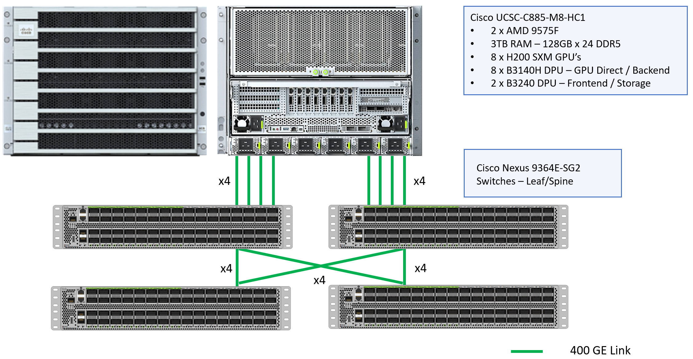
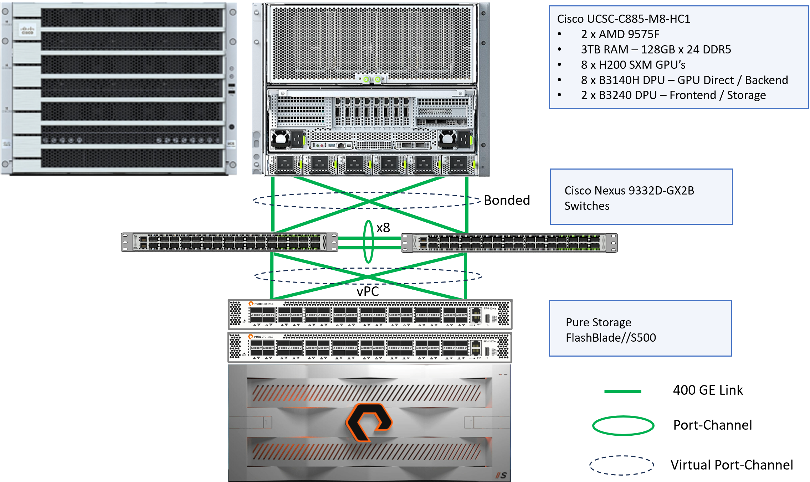
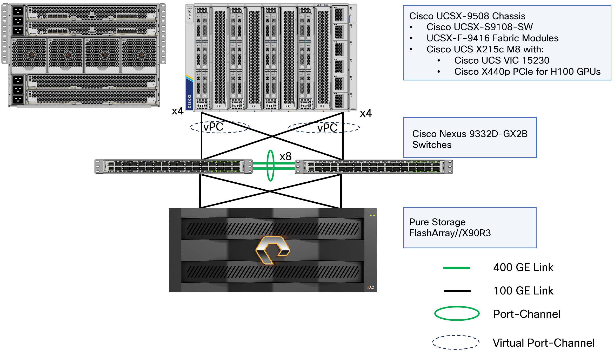

# Cisco AI Pods Runbook

## Top Level Documents
* [Main README](README.md)
* [Prepare the Environment](guide_prepare_the_environment.md)

## Table of Contents
- [Cisco AI Pods Runbook](#cisco-ai-pods-runbook)
  - [Top Level Documents](#top-level-documents)
  - [Table of Contents](#table-of-contents)
  - [Overview](#overview)
    - [Management Components](#management-components)
    - [Architecture Components](#architecture-components)
    - [Back to Table of Contents](#back-to-table-of-contents)
  - [Architecture Diagrams](#architecture-diagrams)
    - [AI Backend Infrastructure](#ai-backend-infrastructure)
    - [AI Frontend Infrastructure](#ai-frontend-infrastructure)
    - [AI Inferencing Infrastructure](#ai-inferencing-infrastructure)
    - [Back to Table of Contents](#back-to-table-of-contents-1)
  - [Firmware/Software Requirements](#firmwaresoftware-requirements)
    - [Compute Components](#compute-components)
    - [Network Components](#network-components)
    - [Software Components](#software-components)
    - [Storage Components](#storage-components)
    - [Back to Table of Contents](#back-to-table-of-contents-2)
  - [⚠️ Environment Deployment Execution Order](#️-environment-deployment-execution-order)
    - [🔄 Rollback Considerations](#-rollback-considerations)
    - [Back to Table of Contents](#back-to-table-of-contents-3)
  - [Pre-Deployment Planning](#pre-deployment-planning)
    - [1. Network Planning](#1-network-planning)
    - [2. Storage Planning](#2-storage-planning)
    - [3. Compute Planning](#3-compute-planning)
    - [4. Security Planning](#4-security-planning)
    - [Required Access and Credentials](#required-access-and-credentials)
    - [Back to Table of Contents](#back-to-table-of-contents-4)
  - [Cisco AI Pods Network Configuration Guide](#cisco-ai-pods-network-configuration-guide)
  - [Cisco AI Pods Intersight Deployment Guide](#cisco-ai-pods-intersight-deployment-guide)
  - [Cisco AI Pods C885A M8 Server Deployment Guide](#cisco-ai-pods-c885a-m8-server-deployment-guide)
  - [Cisco AI Pods Everpure Deployment Guide](#cisco-ai-pods-everpure-deployment-guide)
  - [Cisco AI Pods OpenShift Container Platform Deployment Guide](#cisco-ai-pods-openshift-container-platform-deployment-guide)
    - [Back to Table of Contents](#back-to-table-of-contents-5)
  - [Post-Deployment Tasks](#post-deployment-tasks)
    - [Documentation Updates](#documentation-updates)
    - [Monitoring and Maintenance](#monitoring-and-maintenance)
    - [Backup and Recovery](#backup-and-recovery)
    - [Back to Table of Contents](#back-to-table-of-contents-6)

## Overview

⚠️ **CRITICAL:** Before continuing make sure you have completed the steps in `Prepare the Environment`.

Cisco AI Pods is an automated deployment framework for Cisco FlashStack infrastructure optimized for AI/ML workloads. This runbook provides comprehensive deployment procedures for:

### Management Components
- **Cisco Intersight** - Provides adaptive cloud-powered infrastructure management with automation for agile IT delivery and global reach at any scale
- **Cisco Nexus Dashboard** - Cisco Nexus® Dashboard allows you to simplify your data-center networks with automation and analytics
- **PURESTORAGE | Pure1®** - Pure1® provides the answers you need for operations of a single array or an entire fleet
- **Red Hat OpenShift Container Platform (OCP)** - an industry-leading hybrid cloud application platform that simplifies and accelerates the development, delivery, and lifecycle management of applications across on-premises, public cloud, and edge environments.
- **Splunk Observability Cloud** - a comprehensive platform designed to provide full-stack visibility and enable faster issue resolution for applications, infrastructure, and digital experiences by correlating metrics, logs, and traces in real time.

### Architecture Components
- **Cisco UCS:** Cisco UCS X9508 with X215C M8 Servers / PCIe nodes with H100 GPU's / C885A.
- **Everpure:** Everpure FlashArray//X90R4 and FlashBlade//S500
- **Network:** Cisco Nexus 9332D-GX2B for frontend fabric and N9364E-SG2-O for backend fabric
- **OpenShift Container Platform:** Cisco Intersight Cloud/CVA/PVA

### [<ins>Back to Table of Contents<ins>](#table-of-contents)

## Architecture Diagrams

### AI Backend Infrastructure



### AI Frontend Infrastructure



### AI Inferencing Infrastructure



### [<ins>Back to Table of Contents<ins>](#table-of-contents)

## Firmware/Software Requirements

### Compute Components

| Device | Firmware Version | Notes |
|-------|---------------------|----------------|
| UCSC-885A-M8-HC1 | 1.1(0.250022) | UCS C885A M8 Rack - H200 GPU, 8x B3140H, 2x B3240, 3TB Mem |
| UCSX-215C-M8 | 5.4(0.250040) | UCS X215c M8 Compute Node 2S |
| UCSX-S9108-100G | 4.3(5.250034) | UCS X-Series Direct Fabric Interconnect 9108 100G |

### Network Components

| Device | Firmware Version | Notes |
|-------|---------------------|----------------|
| C8300-1N1S-6T | Dublin-17.12.5a(MD) | Terminal Server |
| N93108TC-FX3 | 10.4(5)(M) | OOB Management |
| N9364E-SG2-O | 10.6(1)(F) | Backend Fabric |
| N9332D-GX2B | 10.6(1)(F) | Frontend Fabric |
| ND Cluster | 4.1 | Nexus Dashboard Cluster |

### Software Components

| Device | Firmware Version | Notes |
|-------|---------------------|----------------|
| Intersight | N/A | Connected or Cloud Delivered Software |
| Isovalent Enterprise | 1.17 | Kubernetes CNI |
| NVIDIA AI Enterprise | 6.3 | UCS X215c M8 Compute Node 2S |
| Portworx | 3.3.0 | Kubernetes CSI |
| Pure1® | N/A | Cloud Delivered Software |
| Red Hat OpenShift | 4.18+ | Kubernetes Environment |
| Splunk Observability Cloud | N/A | Cloud Delivered Software |

### Storage Components

| Device | Firmware Version | Notes |
|-------|---------------------|----------------|
| PureStorage FlashArray//X90R3 | 6.7.4 | Block / File |
| PureStorage FlashBlade//S500 | 4.5.9 | File / Object |

### [<ins>Back to Table of Contents<ins>](#table-of-contents)

## ⚠️ Environment Deployment Execution Order

| Phase | Must Complete Before | Key Validation |
|-------|---------------------|----------------|
| Network Foundation | Any automation scripts | Network connectivity test |
| Intersight/UCS | Storage configuration | Server discovery in Intersight |
| Everpure | Operating System installation | Portworx CSI volume management |
| Red Hat OCP OS deploy | AI Software deployment | CNI / CSI validation |
| NVIDIA AI Enterprise | LLM deployment | All services operational |
| Splunk Observability Cloud | N/A | Full Stack Visiblity |

### 🔄 Rollback Considerations

If any phase fails, follow this rollback approach:
1. **Stop** - Do not proceed to next phase
2. **Diagnose** - Use troubleshooting guide for the failed component
3. **Fix** - Resolve issues before continuing
4. **Validate** - Ensure phase completion before proceeding
5. **Document** - Record any deviations or issues encountered

### [<ins>Back to Table of Contents<ins>](#table-of-contents)

## Pre-Deployment Planning

### 1. Network Planning
- [ ] Document IP address ranges for management, data, and storage networks
- [ ] Plan VLAN assignments for different traffic types
- [ ] Identify uplink configurations and port channels
- [ ] Document global management settings like DNS, NTP, and server information

### 2. Storage Planning
- [ ] Determine storage capacity requirements
- [ ] Plan volume and protection group configurations
- [ ] Document host connectivity requirements
- [ ] Plan snapshot and replication policies

### 3. Compute Planning
- [ ] Determine server profile requirements
- [ ] Plan resource pool allocations (IP, MAC, and UUID)
- [ ] Document policy requirements (boot, network, storage)
- [ ] Plan chassis and domain configurations

### 4. Security Planning
- [ ] Configure centralized authentication services
- [ ] Plan certificate management
- [ ] Document access control requirements
- [ ] Plan encryption and security policies

### Required Access and Credentials
- Cisco Intersight account with appropriate permissions
- Everpure management access
- Network switch administrative access

### [<ins>Back to Table of Contents<ins>](#table-of-contents)

## Cisco AI Pods Network Configuration Guide

Follow the steps in the network configuration section.

[Cisco AI Pods Network Configuration Guide](./network/README.md#cisco-ai-pods-network-configuration-guide)

## Cisco AI Pods Intersight Deployment Guide

Follow the steps in the Intersight configuration section.

[Cisco AI Pods Intersight Deployment Guide](./intersight/README.md#cisco-ai-pods-intersight-deployment-guide)

## Cisco AI Pods C885A M8 Server Deployment Guide

Follow the steps in the C885A M8 configuration section.

[Cisco AI Pods C885A M8 Server Deployment Guide](./c885/README.md#cisco-ai-pods-c885a-m8-server-deployment-guide)

## Cisco AI Pods Everpure Deployment Guide

Follow the steps in the Everpure configuration section.

[Cisco AI Pods Everpure Deployment Guide](./everpure/README.md#cisco-ai-pods-everpure-deployment-guide)

## Cisco AI Pods OpenShift Container Platform Deployment Guide

Follow the steps in the OpenShift configuration section.

[Cisco AI Pods OpenShift Container Platform Deployment Guide](./openshift/README.md#cisco-ai-pods-openshift-container-platform-deployment-guide)

### [<ins>Back to Table of Contents<ins>](#table-of-contents)

## Post-Deployment Tasks

### Documentation Updates

1. **Update Network Documentation:**
   - Document final IP assignments
   - Update network diagrams
   - Record configuration changes

2. **Update Storage Documentation:**
   - Document volume assignments
   - Record storage policies
   - Update capacity planning

3. **Update Compute Documentation:**
   - Document server profiles
   - Record policy assignments
   - Update service mappings

### Monitoring and Maintenance

1. **Set Up Monitoring:**
   - Configure Intersight monitoring
   - Set up Everpure monitoring
   - Implement network monitoring

2. **Schedule Maintenance:**
   - Plan firmware updates
   - Schedule configuration backups
   - Implement change management

### Backup and Recovery

1. **Configuration Backups:**
   ```bash
   # Terraform state backup
   terraform state pull > backup.tfstate
   
   # Network configuration backup
   # (switch-specific commands)
   ```

2. **Documentation Backup:**
   - Save all configuration files
   - Document all customizations
   - Record all passwords and keys

### [<ins>Back to Table of Contents<ins>](#table-of-contents)

---

**Document Version:** 1.2
**Last Updated:** July 12, 2025  
**Prepared By:** Infrastructure Automation Team  
**Approved By:** IT Management  

---

*This runbook should be reviewed and updated regularly to reflect changes in the infrastructure and deployment procedures.*