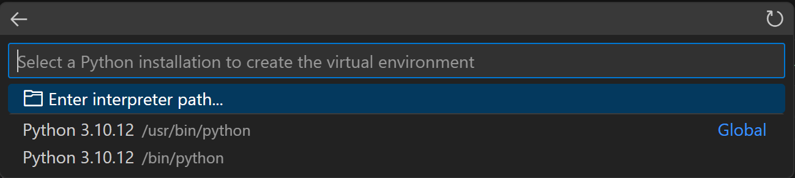
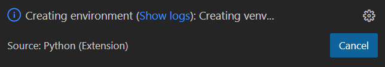
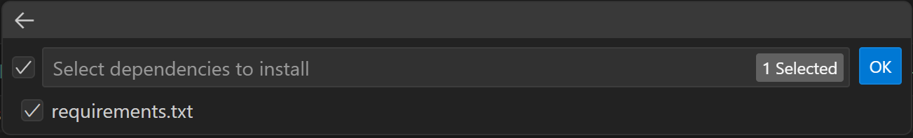

# Prepare the Environment

⚠️ **CRITICAL:** Make sure to complete all tasks below for environment preparation.

## Top Level Documents
* [Main README](README.md)

## Table of Contents
* [Module Dependencies](#module-dependencies)
* [Install Python](#install-python)
* [Install Git](#install-git)
* [Configure Git Credentials](#configure-git-credentials)
* [Install Visual Studio Code](#install-visual-studio-code)
* [Install Visual Studio Code Extensions](#install-visual-studio-code-extensions)
* [YAML Schema for auto-completion, Help, and Error Validation](#yaml-schema-for-auto-completion-help-and-error-validation)
* [Install Ansible](#install-ansible-on-ubuntu)
* [Install Terraform](#install-terraform-on-ubuntu)
* [Clone Repositories](#clone-repositories)
* [Create a Virtual Environment through Visual Studio Code](#create-a-virtual-environment-through-visual-studio-code)

## Module Dependencies

| Component | Minimum Version | Recommended | Notes |
|-----------|----------------|-------------|-------|
| Ansible | 2.9 | 4.0+ | Storage automation |
| Terraform | 1.3.0 | 1.5.0+ | Core automation |
| Intersight Terraform Provider | 1.0.64 | Latest | SaaS compatible |
| Pure Storage Collection | 1.0 | Latest | Ansible Galaxy |
| Python | 3.9 | 3.9+ | Ansible dependency |

### [<ins>Back to Table of Contents<ins>](#table-of-contents)

## Install Python

```bash
sudo apt update && sudo apt install python3-pip -y
```

### Validate Python Install

```bash
python3 --version
```

### Example Output

```bash
$ python3 --version
Python 3.10.12
$
```

### [<ins>Back to Table of Contents<ins>](#table-of-contents)

## Install Git

```bash
sudo apt install git
```

### Validate Git Installation

```bash
git --version
```

### Example Output

```bash
$ git --version
git version 2.34.1
$ 
```

### [<ins>Back to Table of Contents<ins>](#table-of-contents)

## Configure Git Credentials

```bash
git config --global user.name "<username>"   
git config --global user.email "<email>"
```

### [<ins>Back to Table of Contents<ins>](#table-of-contents)

## Install Visual Studio Code

- Download Here: [*Visual Studio Code*](https://code.visualstudio.com/Download)

## Install Visual Studio Code Extensions

- Recommended Extensions: 
  - GitHub Pull Requests and Issues - Author GitHub
  - HashiCorp HCL - Author HashiCorp
  - HashiCorp Terraform - Author HashiCorp
  - Pylance - Author Microsoft
  - Python - Author Microsoft
  - YAML - Author Red Hat (Required)

- Authorize Visual Studio Code to GitHub via the GitHub Extension

### [<ins>Back to Table of Contents<ins>](#table-of-contents)

## YAML Schema for auto-completion, Help, and Error Validation

Add the Following to `YAML: Schemas` in Visual Studio Code: Settings > Search for `YAML: Schema`: Click edit in `settings.json`.  In the `yaml.schemas` section:

```bash
"https://raw.githubusercontent.com/scotttyso/intersight-tools/master/variables/fsai-schema.json": "*.fsai.yaml",
"https://raw.githubusercontent.com/terraform-cisco-modules/easy-imm/main/yaml_schema/easy-imm.json": "*.ezi.yaml"
```

### Example

```json
    "yaml.schemas": {
        "https://raw.githubusercontent.com/terraform-cisco-modules/easy-aci/main/yaml_schema/easy-aci.json": "*.eza.yaml",
        "https://raw.githubusercontent.com/terraform-cisco-modules/easy-imm/main/yaml_schema/easy-imm.json": "*.ezi.yaml",
        "https://raw.githubusercontent.com/scotttyso/intersight-tools/master/variables/fsai-schema.json": "*.fsai.yaml"
    },

```

### [<ins>Back to Table of Contents<ins>](#table-of-contents)

## Install Ansible on Ubuntu

[Others](https://docs.ansible.com/ansible/latest/installation_guide/installation_distros.html)

```bash
sudo apt install software-properties-common
sudo add-apt-repository --yes --update ppa:ansible/ansible
sudo apt install ansible
```

```bash
cd Cisco-AI-Pods/pure_storage
ansible-galaxy collection install -r requirements.yaml
```

### Validate Ansible Installation

```bash
ansible --version
```

### Example Output

```bash
$ ansible --version
ansible 2.10.8
  config file = None
  configured module search path = ['/home/tyscott/.ansible/plugins/modules', '/usr/share/ansible/plugins/modules']
  ansible python module location = /usr/lib/python3/dist-packages/ansible
  executable location = /usr/bin/ansible
  python version = 3.10.12 (main, May 27 2025, 17:12:29) [GCC 11.4.0]
$ 
```

### [<ins>Back to Table of Contents<ins>](#table-of-contents)

## Install Terraform on Ubuntu

[Others](https://developer.hashicorp.com/terraform/tutorials/aws-get-started/install-cli)

Ensure that your system is up to date and you have installed the gnupg, software-properties-common, and curl packages installed. You will use these packages to verify HashiCorp's GPG signature and install HashiCorp's Debian package repository.

```bash
sudo apt-get update && sudo apt-get install -y gnupg software-properties-common
```

#### Install the HashiCorp GPG key.

```bash
wget -O- https://apt.releases.hashicorp.com/gpg | \
gpg --dearmor | \
sudo tee /usr/share/keyrings/hashicorp-archive-keyring.gpg > /dev/null
```

#### Verify the key's fingerprint.

```bash
gpg --no-default-keyring \
--keyring /usr/share/keyrings/hashicorp-archive-keyring.gpg \
--fingerprint
```

#### The gpg command will report the key fingerprint:

```bash
/usr/share/keyrings/hashicorp-archive-keyring.gpg
-------------------------------------------------
pub   rsa4096 XXXX-XX-XX [SC]
AAAA AAAA AAAA AAAA
uid           [ unknown] HashiCorp Security (HashiCorp Package Signing) <security+packaging@hashicorp.com>
sub   rsa4096 XXXX-XX-XX [E]
```

Add the official HashiCorp repository to your system. The lsb_release -cs command finds the distribution release codename for your current system, such as buster, groovy, or sid.

```bash
echo "deb [arch=$(dpkg --print-architecture) signed-by=/usr/share/keyrings/hashicorp-archive-keyring.gpg] https://apt.releases.hashicorp.com $(grep -oP '(?<=UBUNTU_CODENAME=).*' /etc/os-release || lsb_release -cs) main" | sudo tee /etc/apt/sources.list.d/hashicorp.list
```

### Download the package information from HashiCorp and Install Terraform

```bash
sudo apt update && sudo apt install terraform
```

### Verify the Terraform installation

Verify that the installation worked by opening a new terminal session and listing Terraform's available subcommands.

```bash
terraform --version
```

### Example Output

```bash
$ terraform --version
Terraform v1.11.4
on linux_amd64

Your version of Terraform is out of date! The latest version
is 1.12.2. You can update by downloading from https://developer.hashicorp.com/terraform/install
$ 
```

### [<ins>Back to Table of Contents<ins>](#table-of-contents)

## Clone Repositories

```bash
git clone https://github.com/scotttyso/intersight-tools
git clone https://github.com/scotttyso/Cisco-AI-Pods
cd Cisco-AI-Pods
```

## Create a Virtual Environment through Visual Studio Code

To create local environments in VS Code using virtual environments, you can follow these steps: open the Command Palette (Ctrl+Shift+P), search for the Python: Create Environment command, and select it.


### Select an Interpreter



### Visual Studio will create the environment



### Select the Requirements File and press OK



### [<ins>Back to Table of Contents<ins>](#table-of-contents)
