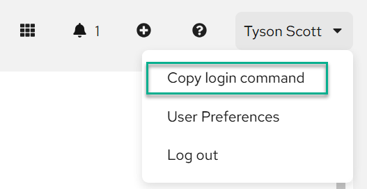
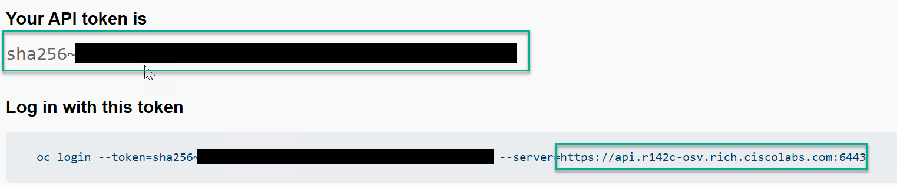

# Portworx Operator Deployment

## Table of Content

  * [Run the Create pure.json module](#run-the-create-purejson-module): Create pure.json module for Portworx Secret / Authentication in OpenShift.
  * [Run the Portworx install module](#run-the-portworx-install-module): Install Portworx Operator create Storage Classes.
  * [Test the Storage Classes](#test-the-storage-classes): Create Example Persistent Volume Claims.

## Run the Create pure.json module

### Load the Variables to Environment

```bash
export pure_api_token_1="pure_api_token_flash_array"
export pure_api_token_2="pure_api_token_flash_blade"
```

* Enter one API token for each array.

**Note**: Match the `api_token_id` number to what you have entered in the variable files in the `script_vars` folder for each array.

### How to Run

1. Run the playbook:

```bash
ansible-playbook create_pure_json.yaml
```

2. If Successful it should create a pure.json file with the API token for each Pure Storage array.

### [Back to Table of Content](#table-of-content)

## Run the Portworx install module

To install Portworx `3.5.2` on OpenShift `4.20+` using Ansible, the most efficient method is to leverage the Operator Lifecycle Manager (OLM). This involves creating the necessary Namespace, OperatorGroup, and Subscription, followed by the StorageCluster Custom Resource (CR).

### Portworx OpenShift Prerequisites

**OCP Access**: A `kubeconfig` file with cluster-admin permissions.
**Portworx Spec**: It is highly recommended to generate your specific StorageCluster YAML from [Portworx Central](https://central.portworx.com/) to match your infrastructure (e.g., vSphere, AWS, or Bare Metal).

## Key Components Explained

**Namespace & OperatorGroup**: Portworx is typically installed in its own namespace (portworx). The OperatorGroup tells OLM which namespaces the operator should watch.
**Subscription**: This pulls the Portworx Operator from the Red Hat Certified Operators catalog.
**StorageCluster CR**: This is the core configuration.
* **kvdb**: Set to internal: true to use Portworx's built-in KVDB. For large production clusters, an external etcd is often preferred.
* **devices**: You must specify the raw block devices available on your OpenShift nodes.
* **stork**: Enabled for advanced scheduling and migration capabilities.

1. Load the Sensitive Variables into the system Environment

Obtain the API token and url by logging into OpenShift > User > Copy Login





```bash
export openshift_api_url="api_url"
export openshift_token_id="token_value"
```

1. Validate that the Variables in the `script_vars/vars.ezcai.yaml` match your expected deployment

3. Run the playbook:

```bash
ansible-playbook install_portworx.yml
```

2. Verify the installation:

```bash
oc get pods -n portworx
oc get storagecluster -n portworx
```

### [Back to Table of Content](#table-of-content)

## Test the Storage Classes

In the folder `examples/pvc` are two example files to deploy Persistent Volume Claims `PVC` to the storage arrays.

```bash
cd examples/pvc
oc apply -f pvc/
```

### [Back to Table of Content](#table-of-content)
