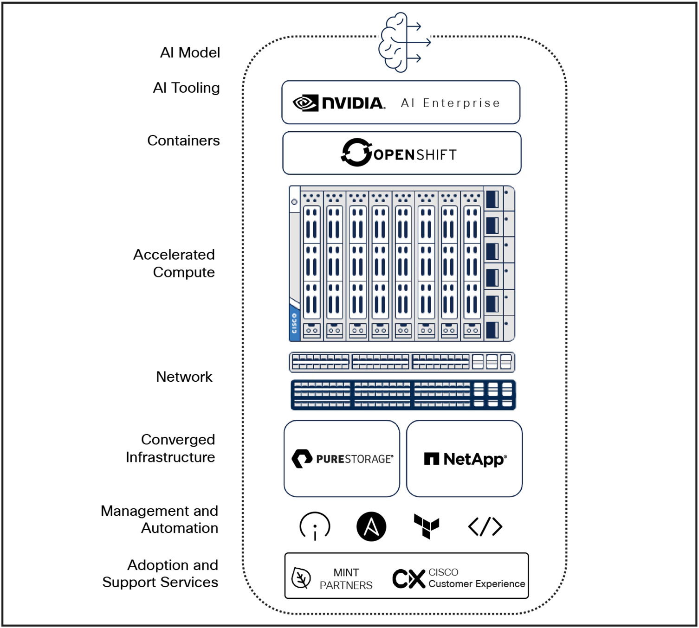
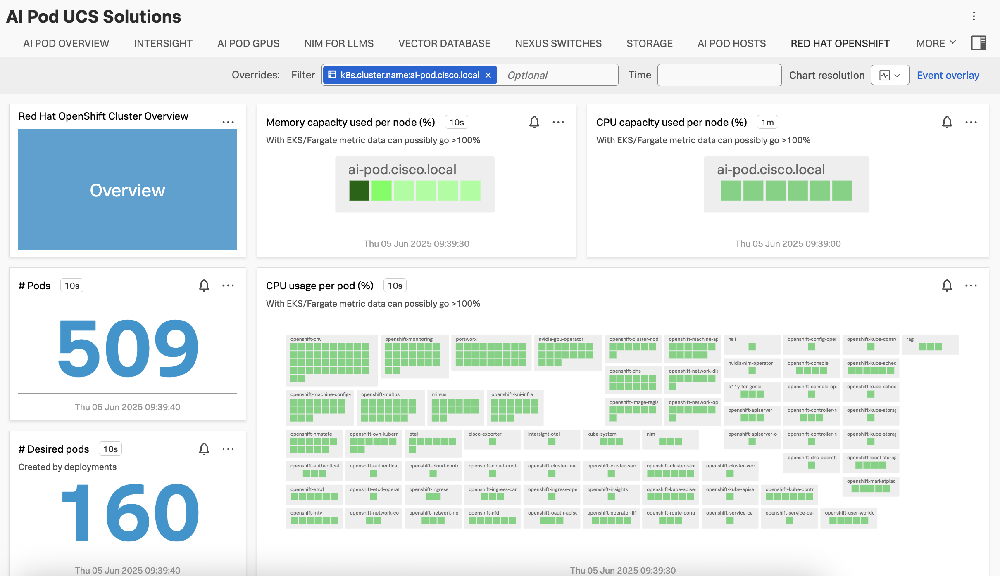
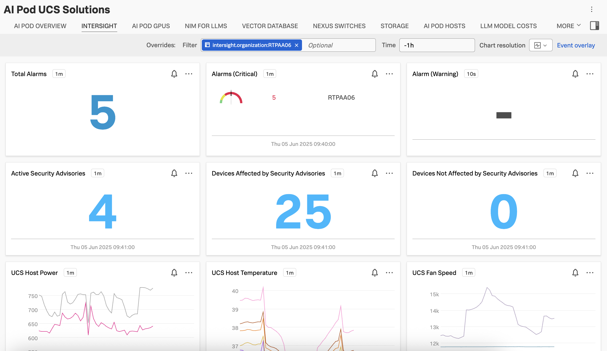
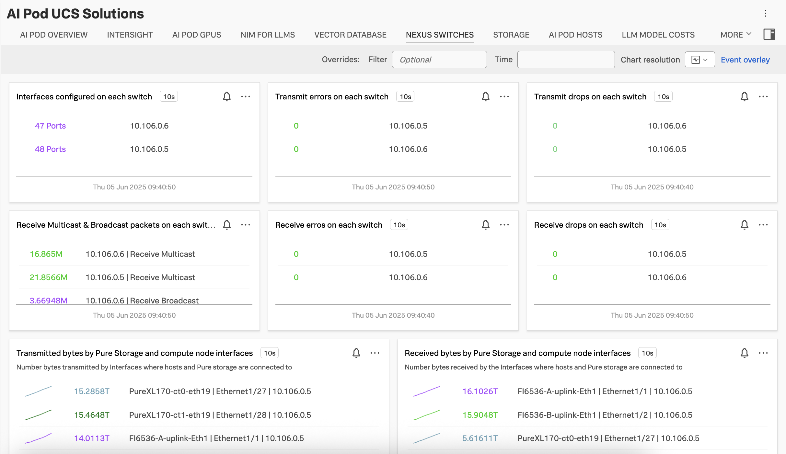
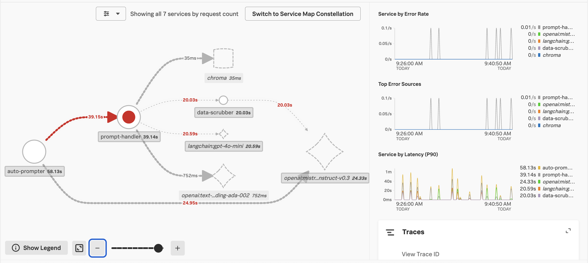
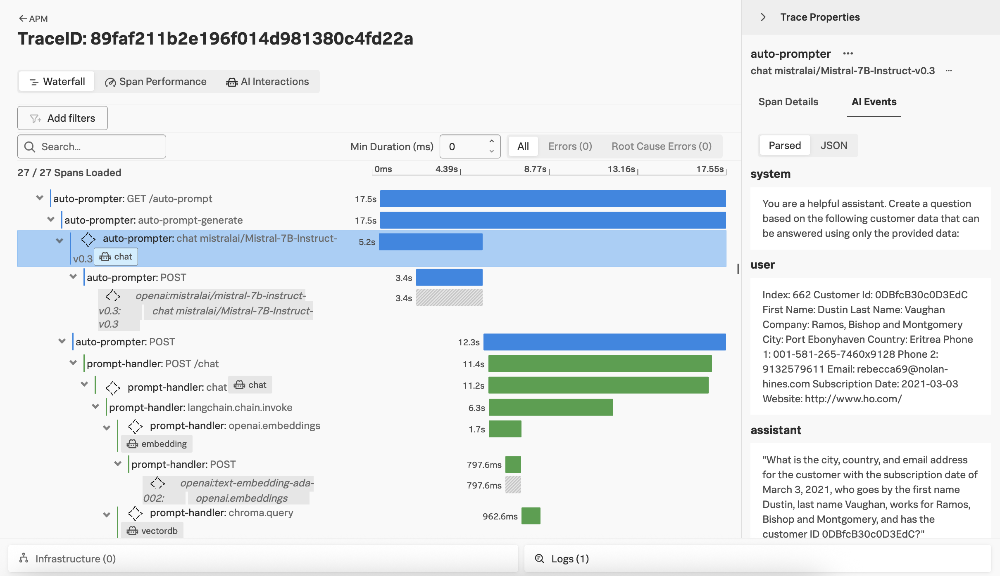

# Splunk Observability for Cisco AI Pods Runbook

## Table of Contents
* [Overview](#overview)
* [Best Practices](#best-practices)
* [Infrastructure Components](#infrastructure-components)
* [Prepare the Environment](#️---critical-prepare-the-environment)
* [Quick Start Workflow](#quick-start-workflow)
* [Templates Reference](#templates-reference)
* [Instrument Applications with OpenTelemetry](#instrument-applications-with-opentelemetry)
* [Support and Escalation](#support-and-escalation)

## Overview

This directory contains comprehensive documentation and automation for integrating Splunk Observability Cloud with Cisco AI Pods infrastructure. Splunk Observability provides comprehensive visibility into the entire AI infrastructure stack, from compute and storage through applications running on OpenShift.

Cisco's AI-ready PODs combine the best of hardware and software technologies to create a robust, scalable, and efficient AI-ready infrastructure tailored to diverse needs.



Source: https://www.cisco.com/c/en/us/products/collateral/servers-unified-computing/ucs-x-series-modular-system/ai-infrastructure-pods-inferencing-aag.html

## Best Practices

### Observability
- Monitor all infrastructure components: compute, storage, and networking
- Set up alerts for critical metrics and anomalies
- Maintain dashboards for operational visibility
- Regular review of observability data for optimization

### Configuration Management
- Document all customizations to the OpenTelemetry collector
- Maintain separate configurations for different environments
- Version control all configuration changes
- Use secure credential management for API tokens

### Security
- Rotate API tokens and credentials regularly
- Use encrypted connections for all data transmission
- Implement proper access controls for observability data
- Regular security audits of monitoring infrastructure

### Operations
- Regular health checks of the collector and integrations
- Scheduled maintenance windows
- Performance monitoring of collection pipeline
- Documentation of any incidents and resolutions

### [<ins>Back to Table of Contents<ins>](#table-of-contents)

## Infrastructure Components

This solution demonstrates how Splunk Observability Cloud monitors a Cisco AI POD with the following components:

* **Cisco Unified Computing System™ (Cisco UCS)** — Ensures compute power required for demanding AI workloads is readily available and scalable
* **FlexPod and FlashStack Converged Infrastructure** — Provides high-performance storage and compute capabilities essential for large-scale AI and machine learning tasks
* **Cisco Nexus Switches** — Provides AI-ready networking designed to support high-performance AI/ML workloads
* **NVIDIA AI Enterprise** — Enables deployment and management of AI workloads
* **Red Hat OpenShift** — Kubernetes-based container platform that simplifies orchestration and deployment of containerized AI applications

Splunk Observability Cloud provides comprehensive visibility into all infrastructure along with all application components running on this stack.

## ⚠️ - **CRITICAL** Prepare the Environment

Before deploying the Splunk monitoring solution, ensure you have:

1. A running Cisco AI Pods cluster with OpenShift configured
2. Kubectl and OpenShift CLI (oc) configured and authenticated
3. Access to Splunk Observability Cloud account with API tokens
4. Helm package manager installed on your workstation
5. The appropriate script variables file configured
6. Kubernetes secrets storage configured for sensitive data

### [<ins>Back to Table of Contents<ins>](#table-of-contents)

## Quick Start Workflow

### Step 1: Install Ansible Requirements

Install Ansible collections from the repository root requirements file by following:

- [Prepare the Environment](../guide_prepare_the_environment.md#install-ansible-on-ubuntu)

Example:

```bash
cd ..
ansible-galaxy collection install -r requirements.yaml
cd splunk-ai-pods
```

### Step 2: Prepare Variables

1. Create the active variables file:

```bash
cp script_vars/vars.ezcai.example.yaml script_vars/vars.ezcai.yaml
```

2. Edit `script_vars/vars.ezcai.yaml` and configure your environment:
   - Cluster name
   - Environment designation
   - Splunk Observability realm and access token
   - Splunk platform endpoint and token (if applicable)
   - Target index for logs

### Step 3: Deploy Using Ansible

Set the required environment variables and run the playbook from this directory:

```bash
export openshift_token_id="<your-openshift-token>"
export openshift_api_url="<your-openshift-api-url>"
export splunk_observability_token="<your-splunk-observability-access-token>"
export splunk_platform_token="<your-splunk-platform-hec-token>"
export nexus_device_password="<your-nexus-device-password>"

ansible-playbook deploy_splunk_ai_pods.yaml
```

**Required Environment Variables:**
- `openshift_token_id` - OpenShift API authentication token
- `openshift_api_url` - OpenShift API server URL (e.g., https://api.cluster.example.com:6443)
- `splunk_observability_token` - Splunk Observability Cloud access token for authentication
- `splunk_platform_token` - Splunk Platform HEC (HTTP Event Collector) token for log ingestion
- `nexus_device_password` - Password for Nexus switch authentication (required if Nexus integration is enabled)

### [<ins>Back to Table of Contents<ins>](#table-of-contents)

## Templates Reference

The deployment playbook uses Jinja2 templates from the `templates/` folder to render Kubernetes resources dynamically based on values in `script_vars/vars.ezcai.yaml` and environment variables.

### Template files and usage

- `templates/otel-values.yaml.j2`
   - Used to render the OpenTelemetry Collector Helm values file.
   - Controls enabled metric sources, proxy settings, filters, and optional integrations (etcd, Intersight, Nexus, Portworx, Trident, NVIDIA metrics).
   - Applied by the Helm deployment task for the Splunk OTel collector.

- `templates/intersight-config-map.yaml.j2`
   - Generates the ConfigMap for the Intersight OTel poller configuration.
   - Defines API pollers and time-series pollers that push Intersight telemetry into the OTel pipeline.

- `templates/intersight-deployment.yaml.j2`
   - Generates the Deployment for the Intersight OTel collector workload.
   - Mounts the Intersight config and API credentials secret and runs the intersight-otel container.

- `templates/nexus-config-map.yaml.j2`
   - Generates the ConfigMap for Cisco Nexus exporter configuration.
   - Builds the device list from `splunk_observability.nexus.device_list` and injects credentials (including `nexus_device_password`).

- `templates/nexus-deployment.yaml.j2`
   - Generates the Deployment for the Cisco Nexus exporter pod.
   - Mounts the generated Nexus config and runs the exporter container.

- `templates/nexus-service.yaml.j2`
   - Generates the Service exposing the Nexus exporter metrics endpoint (port 9362).
   - Enables scraping by the collector's Prometheus receiver.

### How templates are applied

During `ansible-playbook deploy_splunk_ai_pods.yaml`:

1. OpenTelemetry values are rendered and passed to the Helm chart installation.
2. If Intersight integration is enabled, Intersight templates are rendered and applied as Kubernetes resources.
3. If Nexus integration is enabled, Nexus templates are rendered and applied as Kubernetes resources.

### [<ins>Back to Table of Contents<ins>](#table-of-contents)

### Supported Metrics

The [otel-collector/values.yaml](./otel-collector/values.yaml) file includes Prometheus receivers to scrape metrics for the following components:

* Nexus
* NVIDIA GPUs
* NVIDIA NIM for Large Language Models
* NVIDIA NIM for Text Embedding
* NVIDIA NIM for Text Re-Ranking
* Milvus (vector database)
* Cloud-native, software-defined storage

### [<ins>Back to Table of Contents<ins>](#table-of-contents)

## Example Dashboards





### Nexus Integration Overview

This integration is based on the example [here](https://github.com/lwlcom/cisco_exporter). This solution was dockerized and then run as a deployment in the `cisco-exporter` namespace.

It uses SSH to connect to the switches, then scrapes data and exposes those as metrics in Prometheus format at port 9362. These metrics can then be scraped by the Prometheus receiver included in the OpenTelemetry collector deployed above.



### [<ins>Back to Table of Contents<ins>](#table-of-contents)

## Instrument Applications with OpenTelemetry

### Python Application Instrumentation

The Python agent from the Splunk Distribution of OpenTelemetry Python can automatically instrument Python applications by dynamically patching supported libraries. Follow the [steps here](https://docs.splunk.com/observability/en/gdi/get-data-in/application/python/instrumentation/instrument-python-application.html) to start collecting metrics and traces from your Python-based Gen AI applications.

### Step 1: Install OpenTelemetry Python

```bash
pip install openlit
```

### Step 2: Initialize OpenTelemetry Instrumentation

Import the openlit package in your Python code and initialize it:

```python
import openlit
…
# Initialize OpenLIT instrumentation
openlit.init()
```

### Enable Always On Profiling

Activate [Always On Profiling](https://docs.splunk.com/observability/en/gdi/get-data-in/application/python/instrumentation/instrument-python-application.html) if you'd like to capture CPU call stacks for your application as well.

### Enhanced Instrumentation with OpenLIT

The metric and trace data captured by the Splunk Distribution of OpenTelemetry Python can be enhanced with an open-source solution, such as [OpenLIT](https://openlit.io/).





### [<ins>Back to Table of Contents<ins>](#table-of-contents)

## Support and Escalation

For issues with the Splunk Observability integration:

1. Verify all prerequisites are met
2. Check collector pod status: `kubectl get pods -n otel`
3. Review collector logs: `kubectl logs -n otel -l app=splunk-otel-collector`
4. Verify API tokens and endpoint connectivity
5. Validate Kubernetes secrets exist: `kubectl get secrets -n otel`
6. Test network connectivity to external endpoints
7. Consult Splunk documentation and support channels if issues persist
